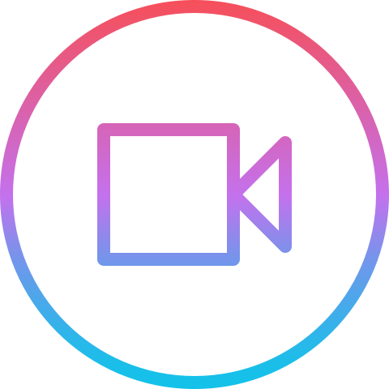

    

# FrontEnd Projects

> Get your hands dirty and build something from a - z

## Projects Ideas

- [App Ideas](https://github.com/florinpop17/app-ideas/)
- [8 Crazy Ideas For Building a Web Site](https://medium.com/@kevink/8-crazy-ideas-for-building-a-web-site-a25b3f69c517)
- [Here’s Yet Another List of Exciting Projects to Build](https://medium.com/better-programming/summer-is-over-you-should-be-coding-heres-yet-another-list-of-exciting-ideas-to-build-a95d7704d36d)
- [The secret to being a top developer is building things! Here’s a list of fun apps to build!](https://medium.com/better-programming/the-secret-to-being-a-top-developer-is-building-things-heres-a-list-of-fun-apps-to-build-aac61ac0736c)
- [✅ Every time you build a to-do list app, a puppy 🐕 dies 😢](https://medium.freecodecamp.org/every-time-you-build-a-to-do-list-app-a-puppy-dies-505b54637a5d)
- [6 Absurd Ideas For Building Your First Web App](https://www.freecodecamp.org/news/6-absurd-ideas-for-building-your-first-web-application-24afca35e519/)
- [Want to build something fun? Here’s a list of sample web app ideas.](https://www.freecodecamp.org/news/want-to-build-something-fun-heres-a-list-of-sample-web-app-ideas-b991bce0ed9a/)
- [8 React.js Project Ideas to Help You Start Learning by Doing](https://www.freecodecamp.org/news/8-reactjs-project-ideas-to-start-learning-by-doing/)

## HTML & CSS

## JavaScript

- [JavaScript 30](https://javascript30.com/)
- [Build 15 JavaScript Projects](https://www.youtube.com/watch?v=3PHXvlpOkf4)
- [10 JavaScript Projects in 1 Hour](https://www.youtube.com/watch?v=8GPPJpiLqHk)
- [10 JavaScript Projects in 10 Hours](https://www.youtube.com/watch?v=dtKciwk_si4)
- [Learn JavaScript by Building 7 Games](https://www.youtube.com/watch?v=lhNdUVh3qCc)

## React

- [Build a Project with GraphQL, Node, MongoDB and React.js](https://www.youtube.com/playlist?list=PL55RiY5tL51rG1x02Yyj93iypUuHYXcB_) - Youtube list
- [Realtime Chat App | React, GraphQL & Websockets](https://www.youtube.com/watch?v=E3NHd-PkLrQ)
- [Code 15 React Projects - Complete Course](https://www.youtube.com/watch?v=a_7Z7C_JCyo)
- [Intermediate React Tutorial - Todoist Clone (with Firebase, Custom Hooks, SCSS, React Testing)](https://www.youtube.com/watch?v=hT3j87FMR6M)
- [Building a Netflix Clone - React Tutorial - Styled Components - Firebase (Firestore & Auth)](https://www.youtube.com/watch?v=x_EEwGe-a9o)
- [React Projects](https://www.youtube.com/playlist?list=PLillGF-RfqbY3c2r0htQyVbDJJoBFE6Rb) - Youtube list _Traversy Media_
- [Master React JS by Building Real Projects](https://www.youtube.com/playlist?list=PL6QREj8te1P6wX9m5KnicnDVEucbOPsqR) - Youtube List _JavaScript Mastery_
- [Build App Clones with ReactJS](https://www.youtube.com/playlist?list=PL-J2q3Ga50oMQa1JdSJxYoZELwOJAXExP) - Youtube list _Clever Programmer_

## Angular

- [Codelab: Building a web application with Angular and Firebase](https://www.youtube.com/watch?v=SnF-6S0bGU4)

## Vue

## Laravel
