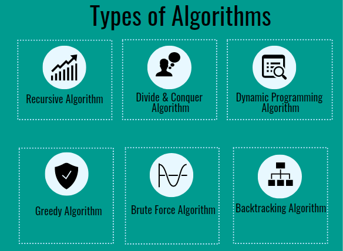
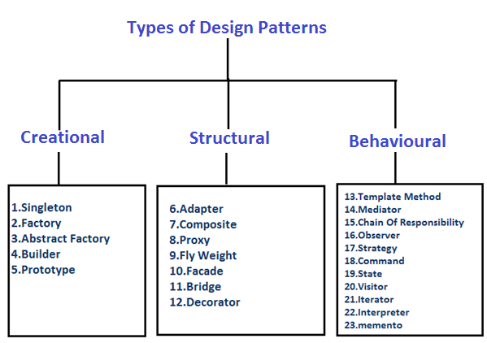

# General Software Topics
> All Links related to development process like management, editor, IDE, git ...etc.

---
## Career Advice

- [Master the JavaScript Interview: Soft Skills](https://medium.com/javascript-scene/master-the-javascript-interview-soft-skills-a8a5fb02c466)
- [101 Tips For Being A Great Programmer (& Human)](https://dev.to/emmawedekind/101-tips-for-being-a-great-programmer-human-36nl)
- [23 Alternative Career Paths that Software Developers Can Grow Into](https://www.freecodecamp.org/news/alternative-career-paths/)
- [13 Simple Rules for Good Coding (from my 15 years of experience)](https://hackernoon.com/few-simple-rules-for-good-coding-my-15-years-experience-96cb29d4acd9)
- [Learn to Code: 13 Tips that Could Save You Years of Effort](https://medium.com/javascript-scene/learn-to-code-13-tips-that-could-save-you-years-of-effort-92ce799a3e1f)
- [10 Steps to Plan Better so you can Write Less Code](https://medium.freecodecamp.org/10-steps-to-plan-better-so-you-can-write-less-code-ece655e03608)
- [All I Really Need to Know About InfoSec, I learned from Mr. Robot](https://medium.freecodecamp.org/all-i-really-need-to-know-about-infosec-i-learned-from-mr-robot-7902cca6d729)

---

## Tools
### Code editor

- [25 VS Code Productivity Tips and Speed Hacks](https://www.youtube.com/watch?v=ifTF3ags0XI)
- [VS Code Top-Ten Pro Tips](https://www.youtube.com/watch?v=u21W_tfPVrY)
- [Top 20 VS Code Shortcuts](https://www.youtube.com/watch?v=4xA5JePvCJc)
- [Visual Studio Code Full Course - VS Code for Beginners](https://www.youtube.com/watch?v=UTQp6mvhb0Y)

### GIT

- [Learn Git in 15 Minutes - Tutorialzine](https://tutorialzine.com/2016/06/learn-git-in-30-minutes)
- [Learn Git in 15 Minutes - Official Tutorial](https://try.github.io/levels/1/challenges/1)
- [How To Use Git And GitHub](https://www.youtube.com/watch?v=Ytux4IOAR_s&list=PLwygftUY318GeCz26jz45yuMWazLgJmxZ) - Udacity

### Markdown

### Searching

### CMD

### Text Search && Manipulation

### Artifacts

- [UML](https://en.wikipedia.org/wiki/Unified_Modeling_Language) (Unified Modeling Language)
- [DFD](https://en.wikipedia.org/wiki/Data-flow_diagram) (Data Flow Diagram)
- [Structure chart](https://en.wikipedia.org/wiki/Structure_chart)
- [Petri net](https://en.wikipedia.org/wiki/Petri_net)
- State Transition Diagram & Tables ([State Machine](https://en.wikipedia.org/wiki/State_diagram))
- [FlowChart Diagram](https://en.wikipedia.org/wiki/Flowchart) & [Decision Table](https://en.wikipedia.org/wiki/Decision_table)

### Debugging

### Misc

- [Microsoft Excel Tutorial for Beginners - Full Course](https://www.youtube.com/watch?v=Vl0H-qTclOg)

### Resources

- [DEV RESOURCES](https://devresourc.es/)

---

## Software Engineering

- [Learn to think](https://brilliant.org/)
- [CSS50](https://cs50.harvard.edu/)
- [Refactoring](https://refactoring.guru/refactoring)
- [The Missing Semester of Your CS Education](https://missing.csail.mit.edu/)

## Data Structure & Algorithms

1. Greedy - choose the best option at the current time, without any consideration for the future.
2. Brute Force - look at all the possibilities and selects the best solution.
3. Divide and Conquer - divide the problem into smaller parts and then solve those parts.
4. Dynamic Programming - build up a solution using previously found sub-solutions.
5. Backtracking - similarly to brute force, try to generate all possible solutions, but each time you generate next solution you test if it satisfies all conditions, and only then continue generating subsequent solutions. Otherwise, backtrack, and go on a different path of finding a solution. Normally the DFS traversal of state-space is being used.
6. Recursive Algorithm

### Courses & Books 📀 📚

- [Algorithms and Data Structures - Full Course for Beginners from Treehouse](https://www.youtube.com/watch?v=8hly31xKli0)
- [Understanding Sorting Algorithms](https://www.youtube.com/watch?v=l7-f9gS8VOs)
- [Dynamic Programming - Learn to Solve Algorithmic Problems & Coding Challenges](https://www.youtube.com/watch?v=oBt53YbR9Kk)
- [Algorithms Course - Graph Theory Tutorial from a Google Engineer](https://www.youtube.com/watch?v=09_LlHjoEiY)

---

## Programming Paradigms

### Object Oriented Programming

- Encapsulation
- Abstraction
- Inheritance
- Polymorphism

### Functional Programming

- Pure function
- Immutability
- No shared state
- No Side effects

---

## Software Design & Architecture

### Design Principles

> In general those concepts are the main building blocks to any design pattern

- KISS Principles (Keep it simple and stupid).
- [The S.O.L.I.D Principles in Pictures](https://medium.com/backticks-tildes/the-s-o-l-i-d-principles-in-pictures-b34ce2f1e898).
- Encapsulate what vars.
- Composition over inheritance.
- DRY (Don't repeat your self).
- YAGNI (You aren't gonna need it).

### Design Patterns

> In software engineering, a software design pattern is a general, reusable solution to a commonly occurring problem within a given context in software design.

- 
### Architecture Patterns
### Architecture Styles
### Architecture Principles

---

## Tech Communities in Egypt ( Facebook )

- [Code Geist](https://www.facebook.com/CodeGeist.CG/)
- [Product Guys](https://www.facebook.com/ProductGuys/)
- [EGDroid](https://www.facebook.com/egdroid/)
- [Ministry of Testing Cairo](https://www.facebook.com/ministryoftestcairo/)
- [Geeks API](https://www.facebook.com/GeeksAPI/)
- [SwiftyCamp](https://www.facebook.com/SwiftyCamp/)
- [Swift Cairo](https://www.facebook.com/swiftcairo/)
- [Tafra.io](https://www.facebook.com/tafraio/)
- [Testing Geeks](https://www.facebook.com/EGTestingGeeks/)
- [Egyptian Programmers - المبرمجون المصريون](https://www.facebook.com/EgyptianProgrammers/)
- [Cairo Testing Meetup](https://www.facebook.com/cairotestingmeetup/)
- [Agile Club](https://www.facebook.com/TheAgileClub/)
- [Egypt Scrum Club](https://www.facebook.com/egyptscrumclub/)
- [Ask Developer Podcast](https://www.facebook.com/askdeveloper/)
- [Google Cloud Developers Community Egypt](https://www.facebook.com/GCDCEgypt/)
- [GDG Cairo](https://www.facebook.com/GDGCairo/)
- [Data Science عربي](https://www.facebook.com/DataScienceArabi/)
- [Cairo AI](https://www.facebook.com/cairoaicommunity/)
- [Egypt Game Developers](https://www.facebook.com/egyptgamedevs/)
- [IGDA Egypt Chapter](https://www.facebook.com/IGDA.Egypt.Chapter/)
- [S3Geeks](https://www.facebook.com/S3Geeks/)
- [EgyptJS](https://www.facebook.com/EgyptJS/)
- [Women Techmakers Cairo](https://www.facebook.com/WTMCairo/)
- [Egyptian Geeks](https://www.facebook.com/groups/egyptian.geeks)
- [Angular Army (ng-arab)](https://www.facebook.com/groups/angular.army)
